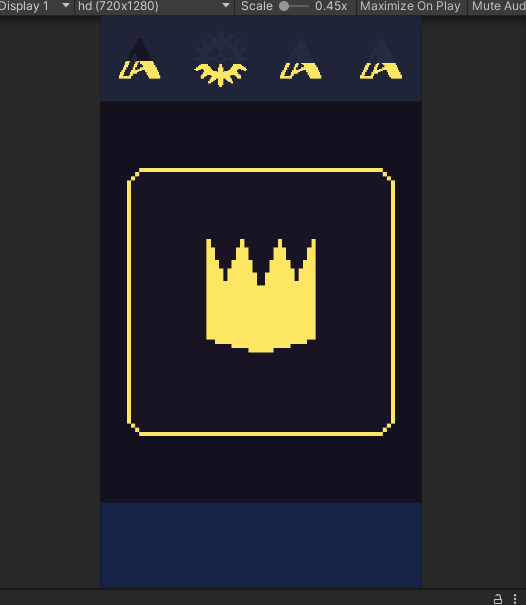

# card-empire
 A card swipe game like Reigns and Tinder

### Features
* 카드 스와이프로 진행되는 스토리텔링 게임  
* [Google Sheets to Unity](https://assetstore.unity.com/packages/tools/utilities/google-sheets-to-unity-73410) 에셋을 사용해 구글 스프레드 시트로부터 카드 데이터를 불러와 ScriptableObject로 Assets\Editor\에 저장
* 카드 하나를 가중치 기반 무작위로 뽑아 게임을 진행
* 카드 데이터 값에 따라 일정 턴 동안 해당 카드가 뽑히지 않거나, 특정 카드를 지정해서 나오게 하거나, 이벤트를 위한 플래그 설정 가능

### Documents
* [카드 데이터 시트](https://docs.google.com/spreadsheets/d/1qkHTR2x5pBfWMTmqkyjBzBA_HeA8AhOhnqN9lvqjlYk/edit#gid=0)  

### Install
1. 프로젝트를 저장
2. 유니티로 Assets\Scene\GameScene.scene 실행
3. Google Sheets to Unity 에셋 Import

### Screenshots
  

### License
* [네이버 나눔 글꼴](https://hangeul.naver.com/font)
* [Google Sheets to Unity](https://assetstore.unity.com/packages/tools/utilities/google-sheets-to-unity-73410)
